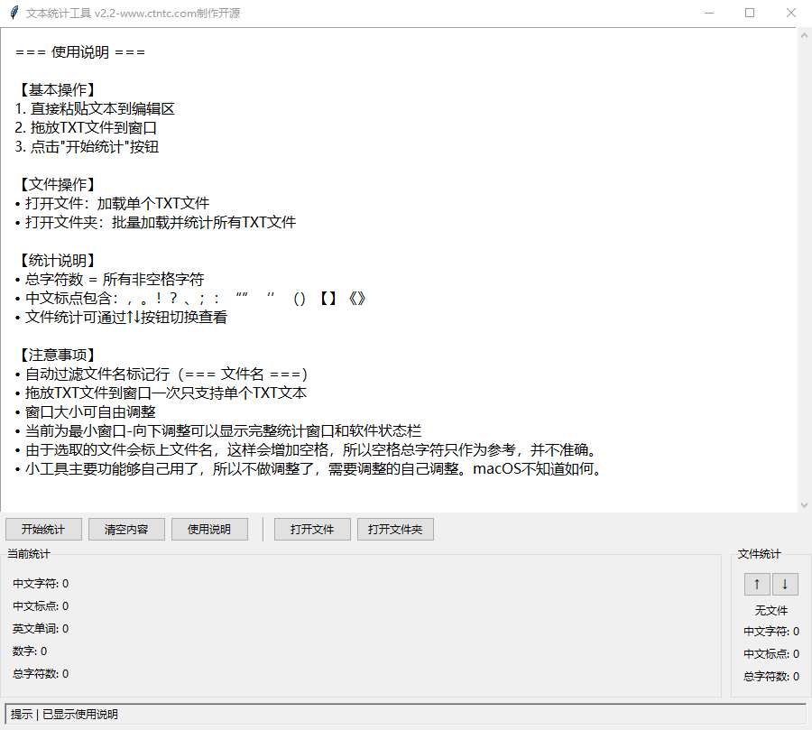

# 中文统计工具 

## 免责声明
我是个没过书的乡下人，我什么都不知道，工具也是AI生成的。
我的工作只是按照AI指挥进行工作和测试。
如果有任何问题，请联系我删除此项目，本人不负责赔偿任何损失。

## 用途检测校队文字数量

## 功能特点

- 🚀 支持直接复制
- 📝 支持拖放TXT文件分析
- 📊 中文字符/标点统计
- 📄 单文件选择
- 📂 文件夹批量统计

## 打包方式
setup.py（全自动处理依赖）

自动检测依赖路径

通过 get_tkinterdnd2_path() 自动查找库安装位置

无需手动指定路径，兼容不同Python环境

跨平台支持

Windows: 使用 cx_Freeze 自动包含依赖

macOS: 通过 py2app 的 includes 声明依赖

资源文件处理

自动扫描 assets 文件夹

图标等资源自动打包

使用流程
## 安装依赖
bash
pip install cx_Freeze py2app tkinterdnd2
## 执行打包
## Windows:
bash
python setup.py build
## macOS:
bash
python setup.py py2app

获取成品

Windows: build/ 目录下的exe文件

macOS: dist/ 目录下的app文件

验证打包是否成功
检查生成的可执行文件是否包含：

tkinterdnd2 文件夹（Windows）

资源文件（如图标）

拖放功能是否正常工作

常见问题解决方案
Q: 打包时报错找不到tkinterdnd2？
A: 确保已正确安装：

bash
复制
pip install tkinterdnd2 --force-reinstall
Q: 如何减小打包体积？
在 setup.py 中添加排除项：

python
复制
build_exe_options = {
    "excludes": ["tkinter", "numpy", "pandas"],  # 排除无用库
    "optimize": 2
}
Q: macOS打包后图标不显示？
确保满足：

图标文件为 .icns 格式

路径配置正确：

python
复制
"iconfile": "assets/app.icns"  # 在py2app配置中
